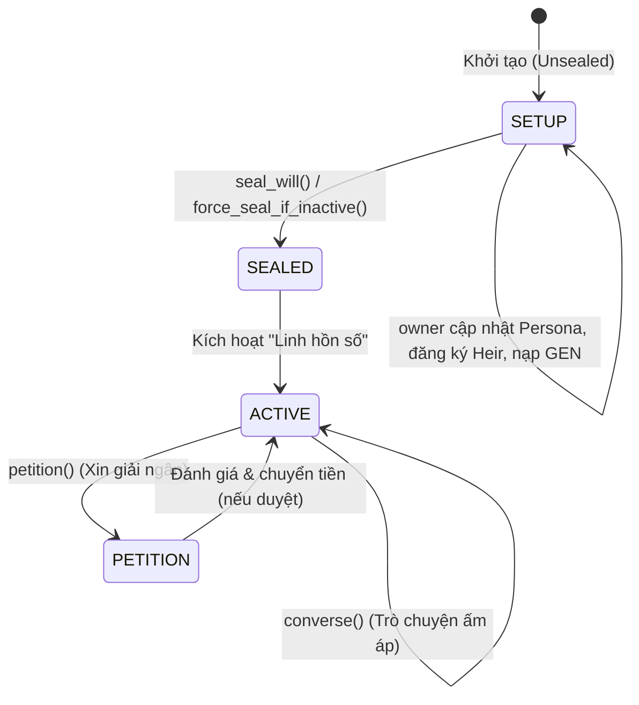
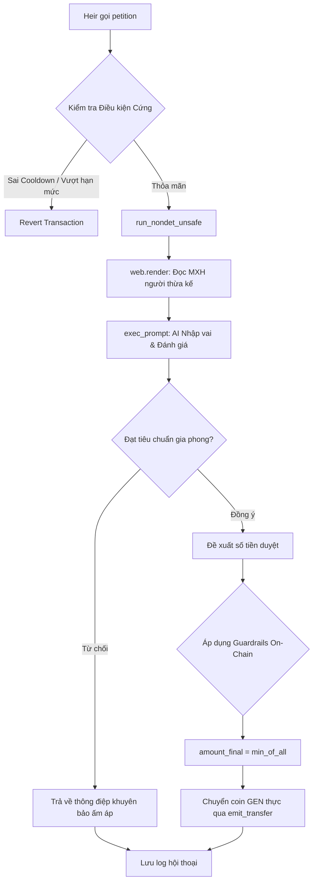

# 👻 Ghost — Dịch Vụ Di Chúc Tâm Hồn Trên GenLayer

> **"Tiền bạc là vật ngoài thân, gia phong và nhân cách mới là gia tài vĩnh cửu."**

**Ghost** là một Intelligent Contract tiên phong chạy trên nền tảng **GenLayer**, cho phép người dùng lập di chúc phân phối tài sản thừa kế dựa trên đánh giá nhân cách và giá trị sống của con cháu bởi một **AI Agent (Linh hồn số)** nhập vai người quá cố. 

Khác với các hợp đồng thông minh truyền thống chỉ có thể thực thi theo các điều kiện cứng nhắc (như thời gian hoặc chữ ký số), Ghost sử dụng khả năng truy cập web phi tập trung và trí tuệ nhân tạo của GenLayer để đưa ra phán định mang tính nhân văn và đúng với mong muốn thực sự của người lập di chúc.

---

## 1. KIẾN TRÚC & VÒNG ĐỜI DI CHÚC

Vòng đời của hợp đồng Ghost trải qua **3 giai đoạn** chính:

### 1.1. Giai đoạn 1: SETUP (Chưa niêm phong)
*   **Mục đích**: Người lập di chúc (`owner`) thiết lập cấu trúc tài sản và gia phong.
*   **Hành động**:
    *   `add_to_persona(text)`: Nạp nhật ký, lời răn dạy, triết lý sống (sau này sẽ dùng làm prompt persona cho AI).
    *   `set_limits(...)`: Đặt hạn mức rút tối đa cho mỗi lần yêu cầu (`max_per_request`), thời gian chờ giữa các lần giải ngân (`release_cooldown`), và chu kỳ điểm danh sống của chủ sở hữu (`inactivity_period`).
    *   `register_heir(...)`: Đăng ký người thừa kế cùng hạn ngạch trần cả đời và liên kết URL mạng xã hội của họ.
    *   `deposit()`: Nạp tài sản (coin GEN gốc) vào két bảo mật.
    *   `heartbeat()`: Chủ sở hữu cập nhật bằng chứng còn sống.

### 1.2. Giai đoạn 2: SEAL (Niêm phong / Người lập qua đời)
*   **Mục đích**: Niêm phong toàn bộ thông tin cấu hình di chúc. Sau khi niêm phong, Persona và thông tin người thừa kế là **bất biến**, không thể chỉnh sửa.
*   **Cơ chế kích hoạt**:
    *   Chủ sở hữu hoặc Người thực thi di chúc (`executor`) gọi `seal_will()`.
    *   **Dead-man's switch**: Nếu chủ sở hữu không gọi `heartbeat()` trong suốt khoảng thời gian `inactivity_period`, bất kỳ ai cũng có thể gọi `force_seal_if_inactive()` để cưỡng chế niêm phong.

### 1.3. Giai đoạn 3: ACTIVE (Đang vận hành)
*   **Mục đích**: Linh hồn số hoạt động, tương tác trực tiếp với con cháu để quyết định phân bổ tài sản.
*   **Hành động**:
    *   `converse(message)`: Trò chuyện tâm sự không xin tiền. AI nhập vai linh hồn ông/cha phản hồi ấm áp, chia sẻ dựa trên ký ức cũ.
    *   `petition(message, requested_amount)`: Yêu cầu giải ngân một khoản tiền thừa kế.

---

## 2. SƠ ĐỒ FLOW PHÁN QUYẾT GIẢI NGÂN

Khi người thừa kế gửi yêu cầu xin tiền qua hàm `petition()`, quy trình xử lý diễn ra như sau:

### 🛡️ Guardrails deterministic an toàn tuyệt đối
Dù AI Agent có toàn quyền đánh giá ngữ cảnh, nhưng quyết định giải ngân tài sản thực tế bị giới hạn cứng bằng code on-chain không thể bị phá vỡ bởi LLM:
$$\text{amount\_final} = \min(\text{amount\_approved\_by\_AI}, \text{remaining\_heir\_allocation}, \text{max\_per\_request}, \text{total\_vault\_balance})$$

---

## 3. THIẾT KẾ VALUE & QUYỀN RIÊNG TƯ TRÊN GENLAYER

### 3.1. Cơ chế chuyển giao tài sản (Value Transfer)
*   **Nạp tiền**: Sử dụng decorator `@gl.public.write.payable` để nhận coin GEN gửi từ ví ngoại vi. Lượng coin nạp được ghi nhận thông qua `gl.message.value`.
*   **Rút tiền**: Khi AI chấp thuận giải ngân, hợp đồng sử dụng `gl.get_contract_at(sender)` để khởi tạo đối tượng đích và gọi `emit_transfer(value=amount_final, on='finalized')` để tự động chuyển coin GEN gốc on-chain về tài khoản người thừa kế.

### 3.2. Quyền riêng tư của Dữ liệu (Privacy)
> [!WARNING]
> Mọi dữ liệu lưu trữ trực tiếp trên chuỗi khối của GenLayer đều mang tính chất **công khai** (public).
> 
> Khuyến nghị người dùng **không lưu trữ nhật ký cá nhân nhạy cảm ở dạng thô (plaintext)** lên `soul_persona`. Thay vào đó:
> 1. Chỉ đưa lên các giá trị gia đình cốt lõi, lời khuyên răn đã lọc.
> 2. Lưu trữ dữ liệu gốc off-chain hoặc mã hóa, chỉ chuyển tải dạng tóm tắt phi nhạy cảm lên chuỗi để AI Agent tham chiếu.

---

## 4. HƯỚNG DẪN DEPLOY TRÊN GENLAYER STUDIO

Để triển khai dự án này lên GenLayer Studio (`https://studio.genlayer.com/run-debug`), hãy tuân thủ quy trình khuyến nghị:

1.  **Chuẩn bị môi trường**:
    *   Mở GenLayer Studio.
    *   Đi tới **Settings -> Reset Storage -> Confirm** để làm sạch trạng thái lưu trữ cũ.
    *   Thực hiện **Hard Refresh** trình duyệt (ví dụ: `Cmd + Shift + R` trên MacOS) để tránh lỗi cache.
2.  **Deploy `storage_test.py`**:
    *   Upload và deploy file `contracts/storage_test.py` trước để kiểm tra tính sẵn sàng của Studio.
    *   Sau khi giao dịch hoàn thành (`Status: FINALIZED`), click vào transaction ở sidebar để chắc chắn `Result: SUCCESS`.
3.  **Deploy `ghost.py`**:
    *   Upload và deploy file hợp đồng chính `contracts/ghost.py`.
    *   Đảm bảo transaction báo `Result: SUCCESS`.
4.  **Chạy kịch bản Demo**:
    *   **Setup**: Từ tài khoản `owner`, gọi `add_to_persona("Gia đình ta coi trọng sự tự lập và nỗ lực...")`.
    *   **Limits**: Gọi `set_limits` với các thông số thử nghiệm (ví dụ: `max_per_request=100000`, `release_cooldown=60` (1 phút), `inactivity_period=3600`).
    *   **Register**: Gọi `register_heir` đăng ký một địa chỉ ví của con cháu, đặt `social_json` ở dạng mảng JSON ví dụ: `'["https://api.github.com/users/octocat"]'`.
    *   **Deposit**: Gửi coin GEN vào hợp đồng thông qua hàm `deposit()` (bật payable gửi GEN).
    *   **Seal**: Gọi `seal_will()` để khóa di chúc.
    *   **Test Trò chuyện**: Chuyển sang tài khoản người thừa kế vừa đăng ký, gọi `converse("Con nhớ cha")`. Kiểm tra `get_convo_log` để xem phản hồi ấm áp từ linh hồn.
    *   **Test Giải ngân**: Gọi `petition("Con xin tiền đóng học phí", 50000)`. Kiểm tra tiền đã chuyển và log được cập nhật. Gọi lại `petition` ngay sau đó để kiểm tra lỗi cooldown chặn thành công.
