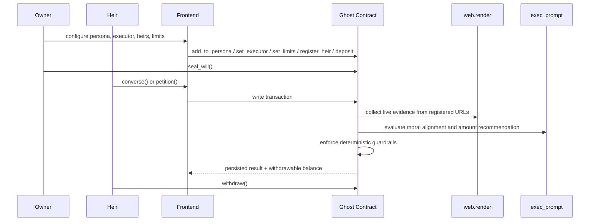

# Ghost Architecture

Ghost is designed as a GenLayer-native inheritance vault where subjective judgment and deterministic treasury controls coexist inside the same workflow.

## Contract Layers

1. `ghost.py`
   The current deployable entrypoint used for Studionet and the Vercel frontend.
1. `ghost_core.py`
   Planned orchestration layer for persona management, heir registration, seal state, conversation, and petition policy.
1. `ghost_treasury.py`
   Planned treasury layer for vault accounting, withdrawable balances, and payout invariants.
1. `ghost_oracle.py`
   Planned oracle layer for `web.render` and LLM prompting patterns guarded by `prompt_comparative`.

## Runtime Flow

## Why GenLayer Fit Is Strong

1. Ghost needs live evidence from the open web during contract execution.
1. Ghost needs subjective moral reasoning about integrity and family values.
1. Ghost still requires hard deterministic financial constraints to cap AI output.

No conventional EVM contract can combine those three properties without off-chain trusted servers.
